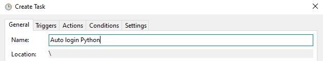
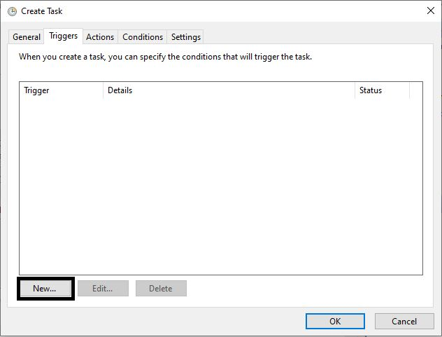

# Mikrotik Auto Login Python 
- No need Selenium (which means no need to update the driver)

Tested on Python 3.8.5


# Requirement
- requests
- urllib
- re
- hashlib

# Set Up
```python
######### SETTING HERE #############
url = 'http://192.168.182.1'
username = 'username'
password = 'password'
####################################
```
# Create Task Scheduler for Windows (Optional)

## Compile to .exe file

`$ pyinstaller --onefile login.py --windowed`

### Create Task







